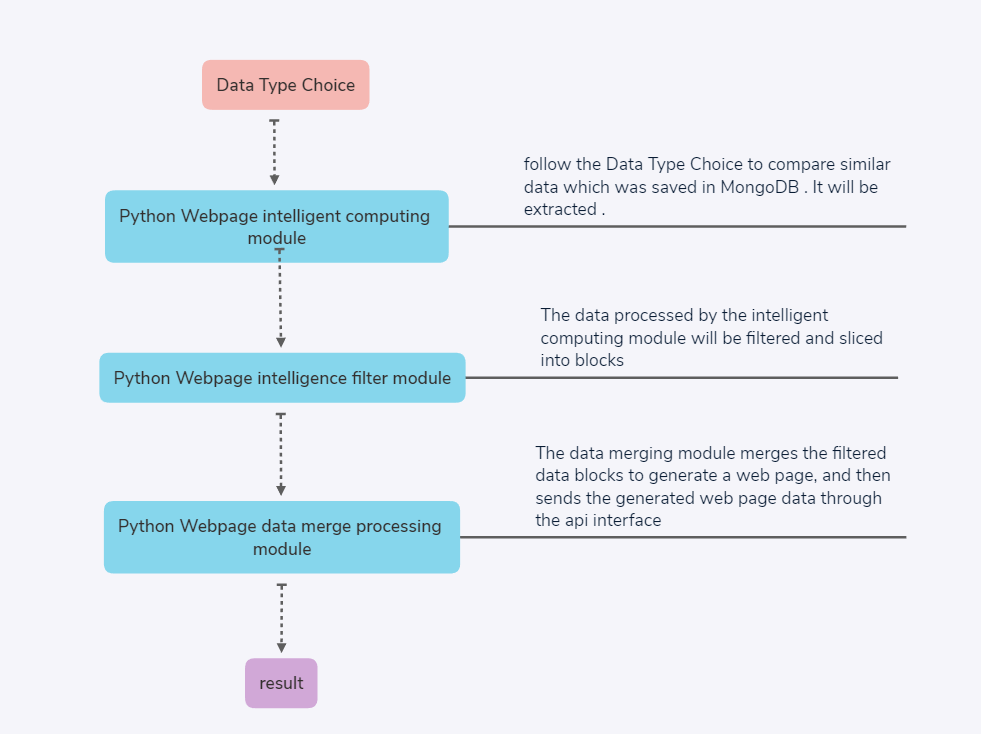

# WanBian

<p align="center"></p>

Wanbian (WanBian), an intelligent production tool capable of various changes, can automatically produce static web pages.

The back-end and artificial intelligence technology uses Python scripting language combined with Github's mature tool libraries for rapid development. The front-end page technology uses traditional HTML, CSS, and JS. The tool core of the entire project is produced based on the Linux operating system, and the data is sent out through the api. Need to call api to get data.
because of the armhf architecture cannot support newest MongoDB，so we cancel storge date in database and use document system replace this method.

After the development of the entire program is completed, the first version will be released on Github, open source and share all technologies.

# Usage
## how to automatically produce docx and html files , other types ,and so on? 
- (1) launch the main.py with some arguments which in WanBian folder.

format:
```bash
> view the help manual:
python main.py help
> create new project:
python main.py new [project name] [project type]
> delete a specific project:
python main.py delete [project name]
> start complie project:
python main.py build [project name]
> view the project type be supported:
python main.py helpProjectType
```

usage example:
```bash
#if you want to produce a new project which name is "demo" with testing type , then input as below format.
main.py new demo 0_testing
#let's change another type , such as 
main.py new demo 1_game
#delete a project which name is demo, such as 
main.py delete demo 1_game
```

what means those nums maps in project type args ?
- 0 prefix means single page product.
- 1 prefix means multiple pages product.

|code|introduction|
|----|----|
|0_testing|produce the testing docx file.|
|0_webpage|produce the homepage html file.|
|0_game|produce the game html+css+js file.|
|1_testing|produce the testing docx files.|
|1_webpage|produce the web page html files.|
|1_game|produce the game html+css+js files.|

which output project types do it supports now ?
```bash
    html , docx , js  
```


- (2) input the project name what you want to create.
- (3) find the csv file with the corresponding project name what in the data folder(data/xxx) in the corresponding project name folder(xxx) , then editor it following to right content format.
- (4) when you finished step (3) , save that csv file and input "WanBian server" in console , it's start up !
- (5) it is located under the data folder that your want.

# How did it work ?

## data stream


# How is the work progress?
Now it is cannot avaliable , the project is still under developing status. 

# Our project plan (Now is the Early stage)
Early stage: achieve automatic production of unlimited non-repetitive web pages. （√）

Middle stage: It can automatically produces web site source codes which only supports the server language is Node.js.（×）

late stage:It can designs all kinds of IoT project solutions , packs the website server ny the way.(×)
