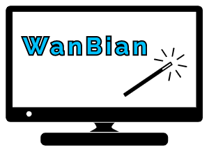
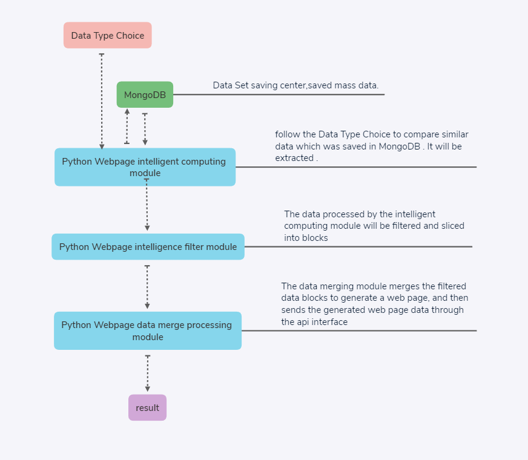

# WanBian

Wanbian (WanBian), an intelligent production tool capable of various changes, can automatically produce static web pages.

The back-end and artificial intelligence technology uses Python scripting language combined with Github's mature tool libraries for rapid development. The front-end page technology uses traditional HTML, CSS, and JS. The tool core of the entire project is produced based on the Linux operating system, and the data is sent out through the api. Need to call api to get data.
because of the armhf architecture cannot support newest MongoDB，so we cancel storge date in database and use document system replace this method.

After the development of the entire program is completed, the first version will be released on Github, open source and share all technologies.

# How did it work ?

## data stream

