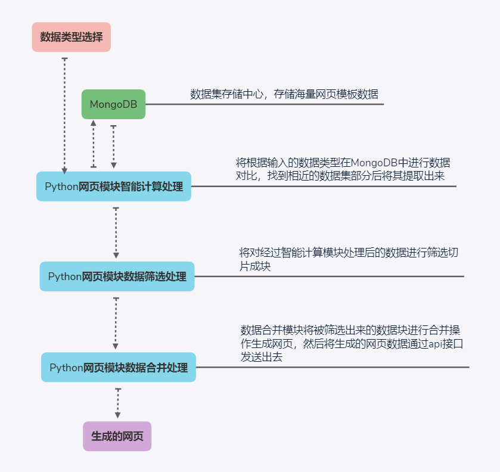

# WanBian

Wanbian (WanBian), an intelligent production tool capable of various changes, can automatically produce static web pages.

The back-end and artificial intelligence technology uses Python scripting language combined with Github's mature tool libraries for rapid development. The front-end page technology uses traditional HTML, CSS, and JS. The tool core of the entire project is produced based on the Linux operating system, and the data is sent out through the api. Need to call api to get data.
because of the armhf architecture cannot support newest MongoDB，so we cancel storge date in database and use document system replace this method.

After the development of the entire program is completed, the first version will be released on Github, open source and share all technologies.

data stream explain: 

-------
# 万变

万变（WanBian），能够进行各种变化的智能生产工具，能自动化生产出静态网页。

后端及人工智能技术采用Python脚本语言结合Github成熟的一些工具库快速开发，前端页面技术采用传统HTML、CSS、JS，整个项目中工具核心基于Linux操作系统进行生产，数据通过api发送出去，用户需要调用api获得数据。

由于armhf架构不能支持最新的MongoDB，所以我们取消了在数据库中存储数据，使用文档系统代替该方法。

整个方案开发完成后将在Github上进行初代版本发布，开源共享全部技术。

数据流图解: 

